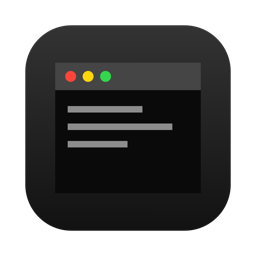
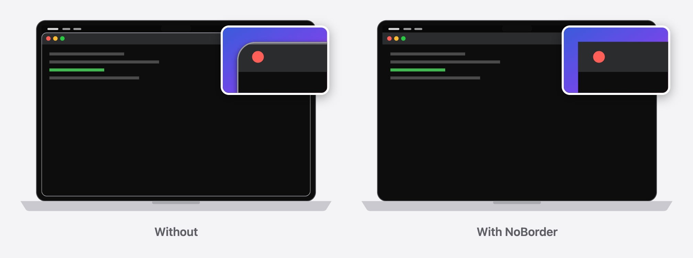

<p align="center">
  
</p>

<h1 align="center">NoBorder</h1>

<p align="center">
  <strong>The look of fullscreen, without fullscreen mode.</strong><br>
  Maximized macOS windows go edge to edge: no outline, no rounded corners, no titlebar rim.
</p>

<p align="center">
  <a href="https://github.com/adambenhassen/macos-no-window-border/releases/latest"></a>
  
  <a href="https://adambenhassen.github.io/macos-no-window-border/"></a>
</p>

<p align="center">
  <a href="https://adambenhassen.github.io/macos-no-window-border/">Website</a> ·
  <a href="https://github.com/adambenhassen/macos-no-window-border/releases/latest/download/NoBorder.zip">Download</a> ·
  <a href="#install">Install</a> ·
  <a href="#how-it-works">How it works</a>
</p>

<p align="center">
  
</p>

## Features

- **No outline or shadow:** removes the 1px gray line WindowServer draws around windows.
- **Square corners:** a maximized window meets the screen edge with no wallpaper showing through.
- **No titlebar rim:** removes the light highlight along the titlebar's top edge (and the line
  under the titlebar).
- **Maximized windows only:** a window counts as maximized when it fills its screen's usable area
  (below the menu bar, beside the Dock). Every other window keeps the normal macOS look.
- **Reversible:** a window that stops being maximized gets back exactly what NoBorder changed,
  unless its app stays busy (see [Costs and limits](#costs-and-limits)). Turning NoBorder off or
  quitting it does the same.
- **Unlike fullscreen mode,** the menu bar and Dock stay put, the window stays on your current
  Space, and nothing slides away.

## Requirements

- macOS 14 or later (tested on macOS 15).
- Xcode installed (NoBorder uses the LLDB Python module that ships with it).
- System Integrity Protection disabled, so NoBorder can attach a debugger to Dock and to apps.
  No boot-args, no reboot beyond disabling SIP.

> [!WARNING]
> Disabling SIP weakens macOS security. Read Apple's
> [Disabling and Enabling System Integrity Protection](https://developer.apple.com/documentation/security/disabling-and-enabling-system-integrity-protection)
> before you do it.

## Install

**Download:** get [NoBorder.zip](https://github.com/adambenhassen/macos-no-window-border/releases/latest/download/NoBorder.zip),
unzip it, move `NoBorder.app` to Applications and open it. It isn't notarized, so macOS blocks
the first launch: open System Settings › Privacy & Security and click **Open Anyway**.

**Build from source:**

```sh
git clone https://github.com/adambenhassen/macos-no-window-border
cd macos-no-window-border
make install     # build NoBorder.app and copy it to /Applications
open /Applications/NoBorder.app
```

## Usage

The menu bar icon shows the status and has **Enabled**, **Launch at Login** and **Quit**.
Turning it off or quitting restores the windows NoBorder changed; while it restores, the menu
shows "Stopping: restoring windows…". A busy app's windows can stay changed if the app is busy
when NoBorder quits.

Logs: `~/Library/Logs/macos-no-window-border.log`.

<details>
<summary>Upgrading from the LaunchAgent version</summary>

Remove the old agent first, or two daemons will fight over the same windows:

```sh
launchctl bootout gui/$(id -u)/local.macos-no-window-border
rm ~/Library/LaunchAgents/local.macos-no-window-border.plist
```

Windows changed by the old version (which changed every window) aren't tracked by NoBorder;
restart those apps, or reopen their windows, once.

</details>

## How it works

- **Outline and shadow:** WindowServer draws the outline as part of the window shadow. Both
  disappear when a window carries WindowServer tag bit 3, the tag `NSWindow.hasShadow = NO`
  sets. WindowServer only accepts that tag from the window's owner or from Dock's privileged
  connection, so the daemon keeps one lldb session attached to Dock and calls
  `SLSSetWindowTags` / `SLSClearWindowTags` from inside it. Dock pauses for a few milliseconds.
- **Corners and rim:** these come from AppKit inside each app, so only that app can change
  them. The daemon attaches lldb to the owning app, queues two calls on the app's main run
  loop, and detaches:
  - `-[NSWindow _setCornerRadius:0.01]` to square the corners (`0` restores the default)
  - `drawsDecorationView = NO` on the titlebar container (`YES` restores the rim; it also
    hides and restores the titlebar separator)

  The calls are queued instead of run at the pause point, because running AppKit code
  wherever the app happened to stop can re-enter it and crash it. For the same reason the
  daemon only queues them when the app's main thread is idle in its run loop.
- **Which windows:** `winscan` lists normal windows every 250 ms with their shadow state and
  whether they fill their screen's `NSScreen.visibleFrame` within 2 pt. A window must stay
  maximized for 2 s before it changes, and un-maximized for 0.5 s before it is restored.

### Costs and limits

- An app freezes for ~1 s each time one of its windows becomes or stops being maximized (~3 s
  for the first app after the daemon starts, while lldb parses the shared cache).
- NoBorder leaves an app alone for its first 30 s after launch; attaching to a starting app
  slows it down.
- The daemon runs nothing inside a busy app. It checks a busy app's window 3 times, then waits
  until the window changes.
- Only AppKit windows (including Chromium and Electron apps) change corners. Others keep them.
- Uses private AppKit and SkyLight APIs. If a macOS update removes the AppKit methods, the
  daemon skips that step instead of crashing the app.

## Development

```sh
make test                          # Python and Swift unit tests
make testtools && tests/e2e.sh     # end-to-end check against a test app (stop NoBorder first)
make testtools && tests/idle.sh    # busy-app check against a test app (NoBorder may run)
make release                       # build/NoBorder.zip for a GitHub release
./noborder.py --pids 123           # run the daemon in a terminal, only for pid 123's windows
```

| Path | What it is |
|---|---|
| `winscan.m` | Window scanner (shadow state, maximized flag) |
| `windowstate.py` | Decides which windows to change or restore |
| `noborder.py` | Daemon driving lldb into Dock and apps |
| `app/` | NoBorder menu bar app (SwiftPM) |
| `docs/` | Website (GitHub Pages) |
| `tests/` | Unit tests, test app, end-to-end and busy-app scripts |
